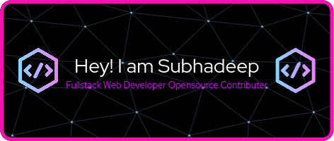

[
<h1 align="center">
    
</h1>
<h3 align="center">A PASSIONATE WEB DEVELOPER AND OPENSOURCE CONTRIBUTOR</h3>
<!---->

  

### All set for HACTOBERFEST-23!   

  

- 🌱 I’m currently learning **Web Development**

<!-- - 📝 I regularly write articles on [https://devinsight.hashnode.dev/](https://devinsight.hashnode.dev/)-->

- 💬 Ask me about **html , css , javascript , git , cpp ,c**

- 📫 How to reach me **banerjeesubhodeep444@gmail.com**

- ⚡ Fun fact **I love humour**

<h3 align="left">Connect with me:</h3>

<h3 align="left">Languages and Tools:</h3>
        
 <!--    -->
    
 

 

  
  
   
  

 

    

 

<h3 align="center">
    
</h3>

 ](url)
